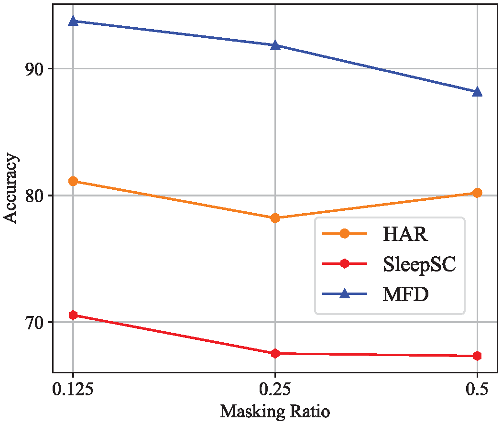
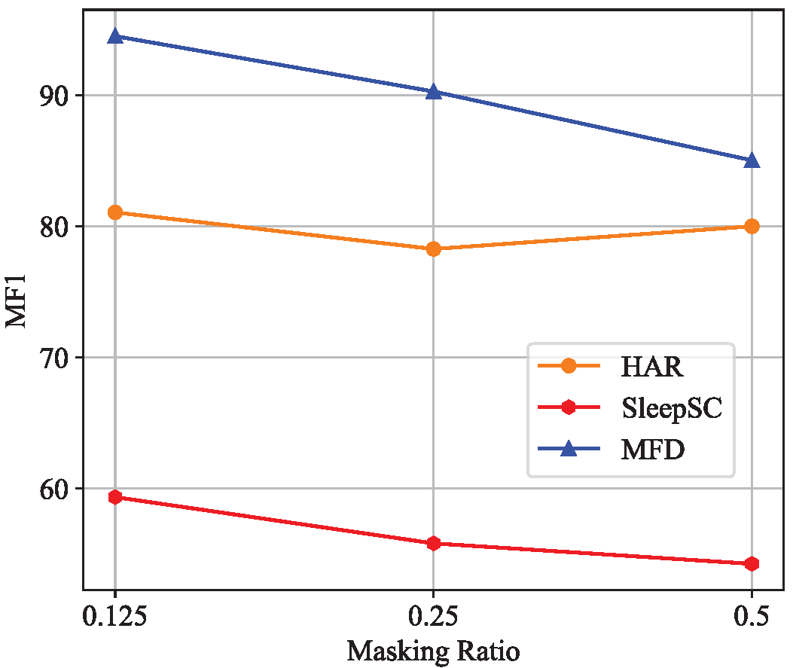
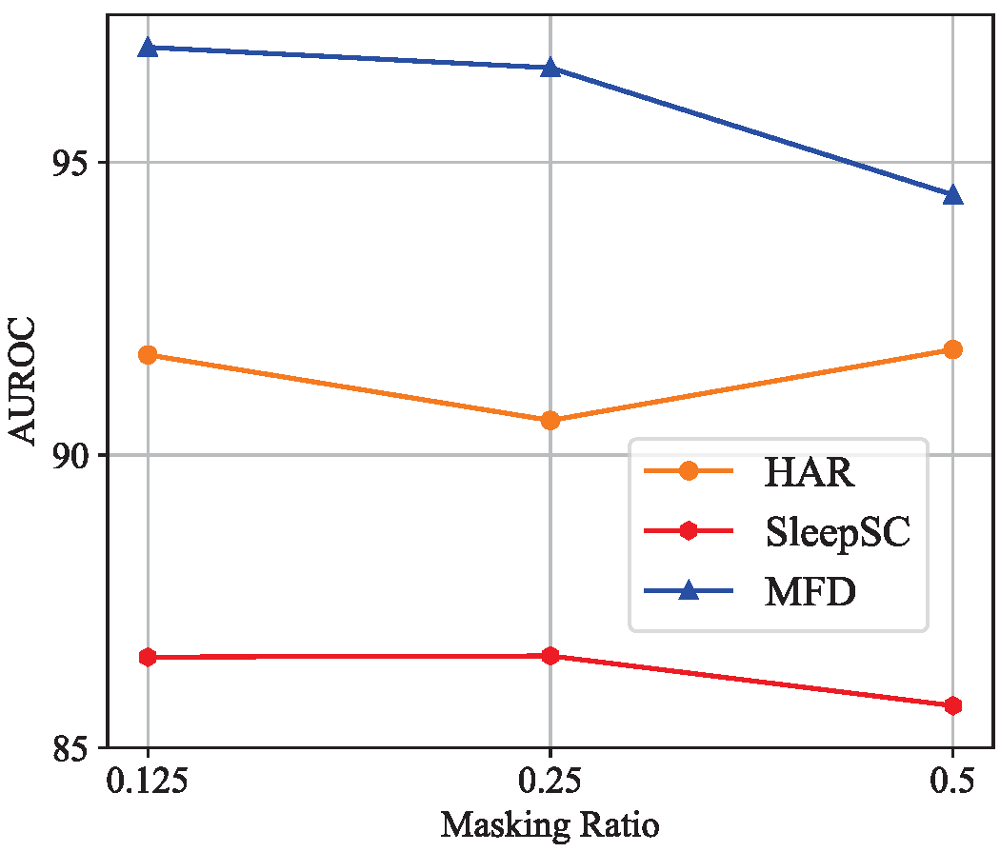

# CORA

## Rebuttal
### Apply the Target Domain Data to the Pre-trained Source Encoder (No Adaptation Stage)
#### HAR dataset
|   Source->Target | Acc |MF1|AUC-ROC|
| -----------| -----------| -----------| -----------|
|2_to_11|	0.9474|	0.9439	|1.0000|
|6_to_23	|0.8393	|0.8192	|0.9982|
|7_to_13	|0.9394	|0.9333	|0.9865|
|9_to_18	|0.7818	|0.7635|	0.935|
|12_to_16	|0.7091	|0.7452	|0.916|
|3_to_10	|0.5393	|0.5761|	0.784|
|11_to_9|	0.5287	|0.4662|	0.8071|
|5_to_10|	0.5169	|0.499|	0.769|
|7_to_10	|0.5393|	0.5321	|0.749|
|10_to_16|	0.7909	|0.7667	|0.9725|
|5_to_9|	0.5402|	0.4697|	0.7621|
|Average|	0.6975|	0.6832	|0.8799|


#### SleepSC dataset
|   Source->Target | Acc |MF1|AUC-ROC|
| -----------| -----------| -----------| -----------|
| 0_to_11 |0.5800|  0.4893| 0.8154|
|12_to_5|0.6719|0.4889|0.8786|
|7_to_18|0.7208|0.6567|0.9242|
|16_to_1|0.6317|0.5541|0.9005|
|9_to_14|0.7836|0.6332|0.9033|
|2_to_11|0.4432|0.4053|0.7890|
|9_to_5|0.6406|0.4837|0.8717|
|12_to_11|0.3276|0.2575|0.6570|
|17_to_11|0.4277|0.3769|0.6913|
|16_to_11|0.3430|0.2911|0.6860|
|6_to_9|0.8274|0.7150|0.9269|
|Average|0.5816|0.4865|0.8222|

#### MFD dataset
|   Source->Target | Acc |MF1|AUC-ROC|
| -----------| -----------| -----------| -----------|
|0_to_1	|0.7125|	0.5864|	0.8363
|1_to_2	|0.8779|	0.9006	|0.9654
|3_to_1	|1.000	|1.000|	1.000|
|1_to_0	|0.8202|	0.7871|	0.96
|2_to_3	|0.9789	|0.9845	|0.9996
|1_to_3	|1.000|	1.000	|1.000|
|0_to_2|0.6482	|0.4712|	0.8366
|0_to_3	|0.7248|	0.6556|	0.8113
|2_to_0|	0.8058|	0.7738	|0.8911
|2_to_1|	0.9667|	0.9755	|0.9996
|3_to_0|	0.7492|	0.7332|	0.9471
|Average	|0.844	|0.8062|	0.9315


## Requirmenets
- Python3.8
- Pytorch==2.0.1
- Numpy==1.23.0
- Sklearn==1.3.2
- Pandas==1.5.3
- skorch==0.15.0

## Datasets

### Available Datasets
We used three public datasets (HAR、SleepSC、MFD) and one industry dataset in this study. We have provide the **preprocessed datasets** in the **"data"** folder.

## Training procedure

To train a model:

```
python trainers/train.py  --save_dir experiments_logs \
                --run_description run_1 \
                --da_method TODA\
                --dataset HAR \
                --backbone CNN \
                --num_runs 1 \
                --splits 8\
                --TOV 0.5\
                --CON 1.0\
                --CON2 1.0\
```

- Each run displays the results of all cross-domain scenarios in the format **"src_to_trg_run_i"**, where src is the source domain number, trg is the target domain number, and i is the run_id. You can run the scenario multiple times by specifying --num_runs i.
- Each directory contains the classification report, log file, checkpoint and different risk scores.
- At the end of all runs, the total average and std results can be found in the run directory.

## Supplemental Experimental Results

### Extention to Universal Domain Adaptation
In practical applications, the distribution information of features or labels in the target domain may be limited. Furthermore, changes in cross-domain label distributions may result in private labels, which are classes that exist in the target domain but not in the source domain, and vice versa. This implies the presence of feature and label shifts between the source and target domains. Universal Domain Adaptation (UniDA) refers to the problem of enabling machine learning models to perform well in the target domain with both feature and label shifts. UniDA allows machine learning models to generalize to novel and diverse domains, thereby enhancing their overall robustness and applicability in real-world scenarios. This poses a challenging key issue in machine learning, especially in the context of SFDA tasks where the source domain data is inaccessible. 

Specifically, TODA focuses on learning domain-invariant temporal features of time-series data, which makes it applicable not only in closed-set DA but also in UniDA. We posit that samples with the same labels correspond to clustered features, while features of unknown samples deviate from these clusters. Based on this observation, we can detect target private samples by assessing the differences in target features before and after the adaptation stage. Experimental evaluations were conducted in three different UniDA settings using the [WISDM](https://doi.org/10.1145/1964897.1964918) and [HHAR](https://doi.org/10.1145/2809695.2809718) datasets, with results presented in Table 1. WISDM and HHAR are both comprised of 3-axis accelerometer data from 30 distinct participants. The data sampling rate for WISDM is 20Hz, while for HHAR it is 50Hz. The experiment uses non-overlapping segments of 128 time steps. The WISDM dataset consists of six activity labels: walking, jogging, sitting, standing, upstairs, and downstairs. Conversely, the HHAR dataset includes six activity labels: biking, sitting, standing, walking, upstairs, and downstairs. It is evident that TODA consistently outperforms the baseline methods. Compared to baseline methods, TODA effectively addresses challenges related to domain adaptation and achieves higher performance.
<table border="1">
  <caption><strong>Table 1. Accuracy of UniDA using WISDM, WISDM&rarr;HHAR, WISDM&rarr;HHAR. Shown: mean Accuracy over 5 independent runs. Higher accuracy is better. Best value in bold.</strong></caption>
    <tr>
        <td>Source&rarr;Target</div></td>
        <td>No. Tar Private Class </td>
        <td><p><a href="https://arxiv.org/abs/2206.06243">CLUDA</a></p> </td>
        <td><p><a href="https://ieeexplore.ieee.org/document/8954135">UAN</a></p></td>
        <td><p><a href="https://proceedings.neurips.cc/paper/2020/file/bb7946e7d85c81a9e69fee1cea4a087c-Paper.pdf">DANCE</a></p></td>
        <td><p><a href="https://ieeexplore.ieee.org/document/9711146">OVANet</a></p></td>
        <td><p><a href="https://proceedings.neurips.cc/paper_files/paper/2022/file/bda6843dbbca0b09b8769122e0928fad-Paper-Conference.pdf">UniOT</a></p></td>
        <td><p><a href="https://dl.acm.org/doi/10.5555/3618408.3618926">Raincoat</a></p></td>
        <td>TODA</td>
    </tr>
    <tr>
        <td>WISDM 3&rarr;WISDM 7</td>
        <td>1</td>
        <td>23.96</td>
        <td>8.04</td>
        <td>8.53</td>
        <td>25.61</td>
        <td>26.78</td>
        <td>28.05</td>
        <td><b>45.31</b></td>
    </tr>
    <tr>
          <td>WISDM 27&rarr;WISDM 28</td>
          <td>2</td>
          <td>8.98</td>
          <td>6.94</td>
          <td>6.74</td>
          <td>7.87</td>
          <td>10.98</td>
          <td><b>53.70</b></td>
          <td>47.19</td>
      </tr>
     <tr>
          <td>WISDM 1&rarr;WISDM 3</td>
          <td>3</td>
          <td>0.00</td>
          <td>32.85</td>
          <td>38.46</td>
          <td><b>61.54</b></td>
          <td>36.31</td>
          <td>35.54</td>
         <td><b>61.54</b></td>
      </tr>
      <tr>
        <td>WISDM 22&rarr;WISDM 17</td>
        <td>4</td>
        <td>26.32</td>
        <td>27.87</td>
        <td>23.68</td>
        <td>40.79</td>
        <td>38.31</td>
        <td>48.16</td>
        <td><b>75.00</b></td>
    </tr>
      <tr>
        <td>WISDM WISDM 27&rarr;WISDM 15</td>
        <td>4</td>
        <td>56.25</td>
        <td>22.18</td>
        <td>27.08</td>
        <td>60.42</td>
        <td>52.34</td>
        <td>66.42</td>
        <td><b>72.22</b></td>
    </tr>
    <tr>
        <td>WISDM 17&rarr;HHAR 4</td>
        <td>1</td>
        <td>12.31</td>
        <td>24.50</td>
        <td>15.94</td>
        <td>25.31</td>
        <td>26.32</td>
        <td>28.41</td>
        <td><b>39.92</b></td>
    </tr>
      <tr>
        <td>HHAR 6&rarr;WISDM 19</td>
        <td>1</td>
        <td>44.50</td>
        <td>43.09</td>
        <td>46.19</td>
        <td>44.08</td>
        <td>45.93</td>
        <td>51.86</td>
        <td><b>53.03</b></td>
    </tr>
</table>


### Masking ratio sensitivity experiment

The effect of the masking ratio on the performance of the temporal completion task is systematically investigated using different masking ratios (i.e., 12.5\%, 25\%, and 50\%) across three different time series applications. Results in Figure 1 show that a masking ratio of 12.5\% achieves optimal performance across all datasets. Higher ratios impede task performance, resulting in lower accuracy, MF1 score, and AUROC due to significant information loss in the original signal. Besides, the poor temporal correlation between large time segments prevents the temporal completer from effectively capturing the temporal information in the source domain.

<table>
<td ><center>accuracy</center></td>
<td ><center>macro-F1</center></td>
<td ><center>AUROC</center></td>
</table>

**Figure 1. Effect of different temporal masking ratios.**